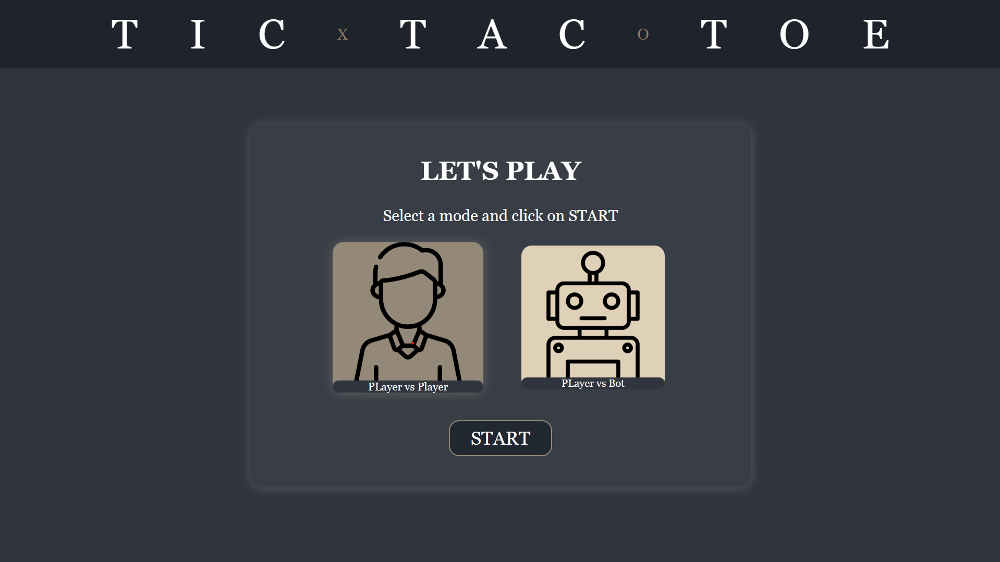
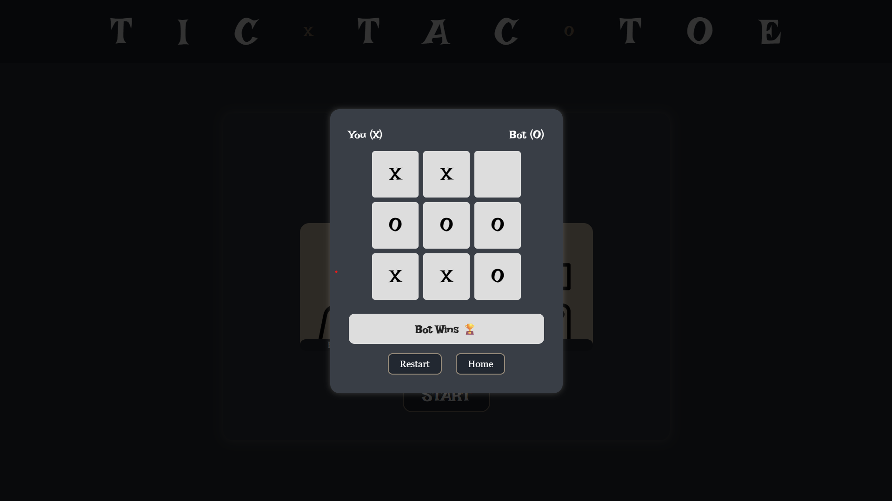

# 🎮 Tic-Tac-Toe (UI Edition)

A visually polished, responsive Tic-Tac-Toe game built using **HTML**, **CSS**, and **JavaScript**. Now featuring a complete browser-based UI with support for both **Player vs Player** and **Player vs Bot** gameplay modes — no console required!

🔗 [Live Demo](https://tic-tac-toe-name-already-taken.netlify.app/)


---

## 🖼️ Preview
<div align="center">   </div>

---

## ▶️ How to Run

1. Clone this repository:
```
   git clone https://github.com/singharyan006/tic-tac-toe.git
```
2. Open index.html in your browser — you're ready to play!

```
⚠️ The console-based versions (v1.x) are still available in previous releases.
```
---

## ✅ Features

- Player vs Player gameplay
- Player vs Computer (Bot) gameplay
- Win and draw detection logic
- Responsive and animated UI
- Random move generation for bot
- Clean architecture using factory functions and module pattern (IIFE)
- Modular, reusable code with minimal global scope usage

---

## 🕹️ Game Modes

- 👤 **Player vs Player**  
  Two players take turns by clicking on the board to make their move.

- 🤖 **Player vs Computer (Bot)**  
  You play as X, and the bot (O) picks a random empty cell after your move.

---

## 📦 Releases

| Version                                                                                  | Description                                         |
| ---------------------------------------------------------------------------------------- | --------------------------------------------------- |
| [`v2.0-ui`](https://github.com/singharyan006/tic-tac-toe/releases/tag/v2.0-ui)           | First interactive UI version with PvP and Bot modes |
| [`v1.1-console`](https://github.com/singharyan006/tic-tac-toe/releases/tag/v1.1-console) | Console version with Bot support                    |
| [`v1.0-console`](https://github.com/singharyan006/tic-tac-toe/releases/tag/v1.0-console) | Initial PvP-only console version                    |


---

## 📁 Project Structure
```
Tic-Tac-Toe/
├── assets/             # Images and UI assets
│   ├── preview1.png
│   ├── preview2.png
│   ├── favicon.png
│   ├── man.png
│   └── robot.png
├── console-version/    # Console-based version
│   └── game.js
├── index.html          # UI entry point
├── style.css           # UI styling
├── script.js           # UI logic
└── README.md
```

---

## 🧠 Built With

- HTML5
- CSS3 (Flexbox, Responsive Design)
- JavaScript (ES6+)
- Vanilla JS (no frameworks)
- Factory Functions
- IIFE (Module Pattern)
- Git & GitHub for versioning

---

## 📌 Versions

**`v2.0-ui`**
> [View latest release](https://github.com/singharyan006/tic-tac-toe/releases/tag/v2.0-ui)

**`v1.1-console`**
> [View previous release](https://github.com/singharyan006/tic-tac-toe/releases/tag/v1.1-console)

**`v1.0-console`**
> [View previous release](https://github.com/singharyan006/tic-tac-toe/releases/tag/v1.0-console)

---

## 🙌 Author

**Aryan Singh**  
Bringing you a clean, interactive Tic-Tac-Toe experience — from terminal to touch ✨

---
